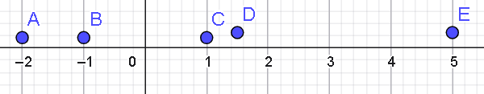

# Ejercicio 01 - Variables aleatorias

**Fecha:** 22-04-2026
**Estado:** 🟢 Resuelto solo

## Consigna

Sea $X$ una variable aleatoria (v.a.) que toma los valores $\{-2,-1,1,1.5,5\}$ con probabilidades $\frac{1}{6}$, $\frac{1}{6}$, $\frac{1}{6}$, $\frac{1}{4}$ y $\frac{1}{4}$ respectivamente. Graficar su función de distribución.

## Resolución

De los ejercicios más fáciles de mi vida... Ojalá sigan así de fáciles :)

