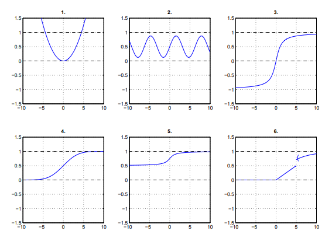

# Ejercicio 04 - Variables aleatorias discretas

**Fecha:** 23-04-2026
**Estado:** 🟢 Resuelto solo

## Consigna

De las gráficas de la figura, indicar cuáles son función de distribución (f.d.) y cuáles no lo son.

## Resolución

Listemos una por una e indiquemos si son o no son y porque:

1. **No es una función de distribución:** No está contenida entre $0$ y $1$.
2. **No es una función de distribución:** No es monótona.
3. **No es una función de distribución:** No está contenida entre $0$ y $1$.
4. **Si es una función de distribución:** Contenida entre $0$ y $1$, monótona creciente, continua (en particular por derecha).
5. **No es una función de distribución:** Su límite en $-\infty$ no converge a cero.
6. **No es una función de distribución:** No es continua por derecha en todos los puntos (5 es el punto problemático en este caso).
