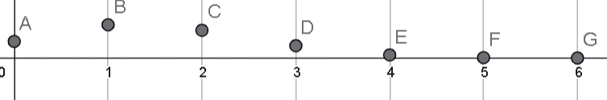

# Ejercicio 08 - Distribuciones discretas

**Fecha:** 24-04-2026
**Estado:** 🟢 Resuelto solo

## Consigna

Graficar la función de distribución y la función de probabilidad de una variable aleatoria con distribución $\text{Bin}(6,0.25)$.

## Resolución

Con los datos dados, tenemos que el conjunto $A=\{0,1,2,3,4,5,6\}$. Y la función está definida por:

- $p(k)=\binom{6}{k}\cdot(\frac{1}{4})^k\cdot(\frac{3}{4})^{6-k}$

Usando una calculadora, hallamos las probabilidades para todos los valores de $A$, para poder graficar la función de probababilidad:

- $p(0)=\frac{729}{4096}$
- $p(1)=\frac{729}{2048}$
- $p(2)=\frac{1215}{4096}$
- $p(3)=\frac{135}{1024}$
- $p(4)=\frac{135}{4096}$
- $p(5)=\frac{9}{2048}$
- $p(6)=\frac{1}{4096}$

Por otra parte, llamamos $F_X$ a la función de distribución acumulada, entonces tenemos que:

- $F_X(0)=\frac{729}{4096}$
- $F_X(1)=\frac{2187}{4096}$
- $F_X(2)=\frac{3402}{4096}$
- $F_X(3)=\frac{3942}{4096}$
- $F_X(4)=\frac{4077}{4096}$
- $F_X(5)=\frac{4095}{4096}$
- $F_X(6)=1$

No graficaremos por una cuestión de simplicidad, pero es una función por escalones que pegan saltos cada vez que se cambia a un natural. Por ejemplo, entre tres y cuatro, el escalón tiene una altura de $\frac{3942}{4096}$.
