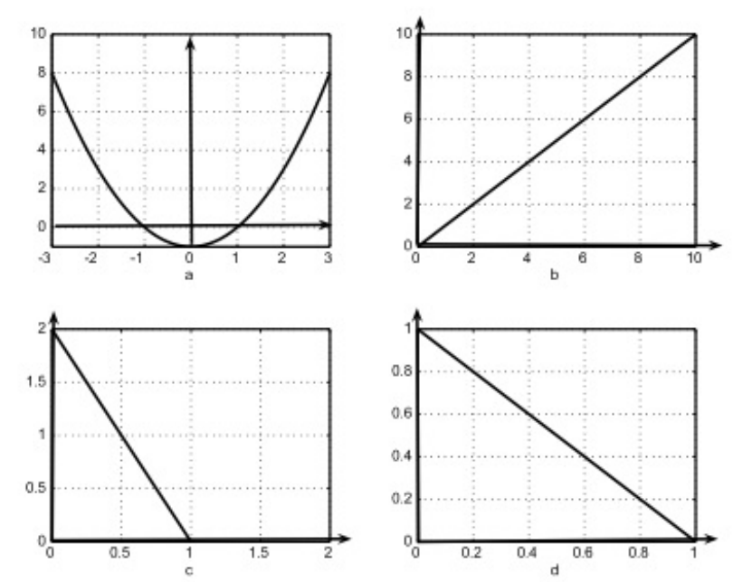

# Ejercicio 02 - Variables aleatorias continuas

**Fecha:** 27-04-2026
**Estado:** 🟢 Resuelto solo

## Consigna

¿Cuáles de las gráficas de la figura corresponden a una densidad y cuáles no?

## Resolución

Vayamos figura por figura:

- **Figura #1:** No puede ser una densidad ya que es negativa en el intervalo $(-1,1)$
- **Figura #2:** No puede ser una densidad ya que el área bajo la curva en el dominio establecido es $10\cdot10/2=50$. Tiene que ser 1 para ser una densidad válida.
- **Figura #3:** Es efectivamente una densidad, siempre positiva y el área bajo su curva es $1\cdot2/2=1$.
- **Figura #4:** No puede ser una densidad ya que el área bajo la curva en el dominio establecido es $1\cdot1/2=\frac{1}{2}$. Tiene que ser 1 para ser una densidad válida.
