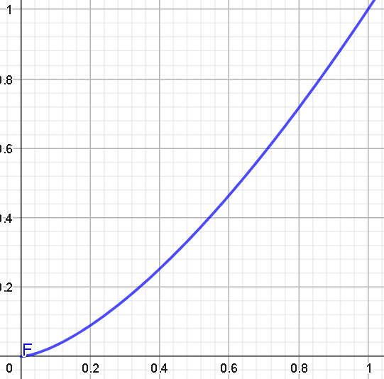

# Ejercicio 04 - Variables aleatorias continuas

**Fecha:** 27-04-2026
**Estado:** 🟢 Resuelto solo

## Consigna

Se consideran las siguientes funciones reales:

$$f_1(x)=\begin{cases}c_1\sqrt{x} & \text{si }x\in(0,1)\\0 & \text{si }x\notin(0,1)\end{cases}$$

$$f_2(x)=\begin{cases}0 & \text{si }x<1\\c_2x^2 & \text{si }x\in[1,2]\\c_2x & \text{si }x\in(2,3)\\0 & \text{si }x\geq3\end{cases}$$

1. En cada caso, hallar $c_i$ para que $f_i$ sea una densidad.

2. Se considera ahora una variable aleatoria $X$ con densidad $f_i$ (con el $c_i$ hallado).
   1. Calcular $P(0.3<X<0.6)$, $P(X>2)$ y $P\!\left(\frac{1}{2}<X<\frac{3}{2}\right)$.
   2. Hallar la función de distribución $F_X$ para cada densidad y graficar.

## Resolución

### Parte 1

- En cada caso, hallar $c_i$ para que $f_i$ sea una densidad.

#### Función 1

- $f_1(x)=\begin{cases}c_1\sqrt{x} & \text{si }x\in(0,1)\\0 & \text{si }x\notin(0,1)\end{cases}$

Para que $f_1$ sea una densidad tenemos que verificar que el área en el soporte de la función (en este caso el intervalo $(0,1)$) sume uno, entonces:

$$
\begin{aligned}
&\int_{0}^{1}f_1(x)=1\\
&\iff\scriptstyle{(\text{reemplazando la función }f)}\\
&\int_{0}^{1}c_1\sqrt{x}=1\\
&\iff\scriptstyle{(\text{operatoria})}\\
&c_1\int_{0}^{1}x^{1/2}=1\\
&\iff\scriptstyle{(\text{operatoria})}\\
&c_1\left(\frac{2}{3}1^{3/2}-0\right)=1\\
&\iff\scriptstyle{(\text{operatoria})}\\
&c_1=\frac{3}{2}\\
\end{aligned}
$$

#### Función 2

- $f_2(x)=\begin{cases}0 & \text{si }x<1\\c_2x^2 & \text{si }x\in[1,2]\\c_2x & \text{si }x\in(2,3)\\0 & \text{si }x\geq3\end{cases}$

Para que $f_2$ sea una densidad tenemos que verificar que el área en el soporte de la función (en este caso el intervalo $[1,2]$) sume uno, entonces:

$$
\begin{aligned}
&\int_{1}^{3}f_2(x)dx=1\\
&\iff\scriptstyle{(\text{propiedades de integrales})}\\
&\int_{1}^{2}f_2(x)dx+\int_{2}^{3}f_2(x)dx=1\\
&\iff\scriptstyle{(\text{definición de }f)}\\
&\int_{1}^{2}c_2x^2dx+\int_{2}^{3}c_2xdx=1\\
&\iff\scriptstyle{(\text{operatoria})}\\
&c_2\cdot\left(\int_{1}^{2}x^2dx+\int_{2}^{3}xdx\right)=1\\
&\iff\scriptstyle{(\text{operatoria})}\\
&c_2\cdot\left(\left(\frac{x^3}{3}\right)\Big|^2_1+\left(\frac{x^2}{2}\right)\Big|_2^3+\right)=1\\
&\iff\scriptstyle{(\text{operatoria})}\\
&c_2\cdot\left(\frac{8}{3}-\frac{1}{3}+\frac{9}{2}-2\right)=1\\
&\iff\scriptstyle{(\text{operatoria})}\\
&c_2\cdot\left(\frac{7}{3}+\frac{5}{2}\right)=1\\
&\iff\scriptstyle{(\text{operatoria})}\\
&c_2\cdot\left(\frac{14+15}{6}\right)=1\\
&\iff\scriptstyle{(\text{operatoria})}\\
&c_2\cdot\left(\frac{29}{6}\right)=1\\
&\iff\scriptstyle{(\text{operatoria})}\\
&c_2=\frac{6}{29}\\
\end{aligned}
$$

### Parte 2

- Se considera ahora una variable aleatoria $X$ con densidad $f_i$ (con el $c_i$ hallado).
   1. Calcular $P(0.3<X<0.6)$, $P(X>2)$ y $P\!\left(\frac{1}{2}<X<\frac{3}{2}\right)$.
   2. Hallar la función de distribución $F_X$ para cada densidad y graficar.

#### Función 1

- $f_1(x)=\begin{cases}\frac{3}{2}\sqrt{x} & \text{si }x\in(0,1)\\0 & \text{si }x\notin(0,1)\end{cases}$

##### Subparte 1

- Calcular $P(0.3<X<0.6)$, $P(X>2)$ y $P\!\left(\frac{1}{2}<X<\frac{3}{2}\right)$.

Vayamos uno a uno simplemente aplicando la definición (y propiedades):

**Primera probabilidad:**

$$
\begin{aligned}
&P(0.3<X<0.6)=\int_{0.3}^{0.6}f_1(x)\\
&\iff\scriptstyle{(\text{reemplazando }f_1)}\\
&P(0.3<X<0.6)=\int_{0.3}^{0.6}\frac{3}{2}\sqrt{x}\\
&\iff\scriptstyle{(\text{operatoria})}\\
&P(0.3<X<0.6)=\frac{3}{2}\int_{0.3}^{0.6}\sqrt{x}\\
&\iff\scriptstyle{(\text{operatoria})}\\
&P(0.3<X<0.6)=\frac{3}{2}\cdot\left(\frac{2}{3}\cdot0.6^{3/2}-\frac{2}{3}\cdot0.3^{3/2}\right)\\
&\iff\scriptstyle{(\text{operatoria})}\\
&P(0.3<X<0.6)=0.6^{3/2}-0.3^{3/2}\\
&\iff\scriptstyle{(\text{operatoria})}\\
&P(0.3<X<0.6)\approx0.300\\
\end{aligned}
$$

**Segunda probabilidad:**

Esta probabilidad es bien fácil, por suerte. Como la función se anula para todo $x\geq1$, podemos concluir que la probabilidad $P(X>2)=0$

**Tercera probabilidad:**

Recordemos que el intervalo pasando $x=1$ se anula. Por lo tanto tenemos que.

- $P\!\left(\frac{1}{2}<X<\frac{3}{2}\right)=P(\frac{1}{2}<X<1)$

Entonces, operando con esto en mente:

$$
\begin{aligned}
&P\!\left(\frac{1}{2}<X<1\right)=\int_{1/2}^{1}f_1(x)dx\\
&\iff\scriptstyle{(\text{definición de }f_1)}\\
&P\!\left(\frac{1}{2}<X<1\right)=\int_{1/2}^{1}\frac{3}{2}\sqrt{x}dx\\
&\iff\scriptstyle{(\text{operatoria})}\\
&P\!\left(\frac{1}{2}<X<1\right)=\frac{3}{2}\int_{1/2}^{1}\sqrt{x}\\
&\iff\scriptstyle{(\text{operatoria})}\\
&P\!\left(\frac{1}{2}<X<1\right)=\frac{3}{2}\left(\frac{2}{3}\cdot1^{3/2}-\frac{2}{3}\cdot1/2^{3/2}\right)\\
&\iff\scriptstyle{(\text{operatoria})}\\
&P\!\left(\frac{1}{2}<X<1\right)=1-1/2^{3/2}\\
&\iff\scriptstyle{(\text{operatoria})}\\
&P\!\left(\frac{1}{2}<X<1\right)\approx0.646\\
\end{aligned}
$$

##### Subparte 2

- Hallar la función de distribución $F_X$ para cada densidad y graficar.

Simplemente veremos la gráfica en el intervalo $(0,1)$ pues es el que nos interesa considerar. Ya sabemos que la función de distribución $F_X$ es la integral de la función $f_X$, por lo tanto la definimos por:

- $F_X(x)=\int_{0}^{x}\sqrt{t}dt$

#### Función 2

Es el mismo procedimiento que el que hicimos para la función 1. No lo voy a hacer por cuestión de ahorrar tiempo.