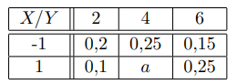
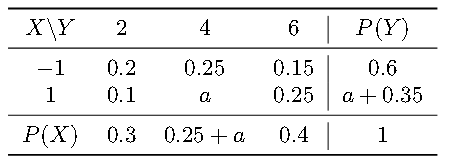
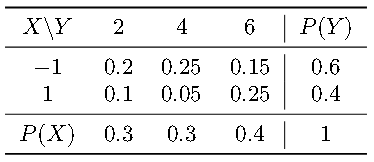

# Ejercicio 02 - Distribución conjunta y variables independientes

**Fecha:** 18-05-2026
**Estado:** 🟢 Resuelto solo

## Consigna

Se consideran dos variables aleatorias: $X$, que toma los valores $-1$ y $1$ e $Y$ que toma los valores $2$, $4$ y $6$ con las probabilidades conjuntas dadas por la siguiente tabla:

1. Hallar $a$.
2. Calcular $P\{X<1,Y=4\}$.
3. Hallar las funciones de probabilidad de $X+2Y$, $X+Y$, y $|X-Y|$.

## Resolución

### Parte 1

- Hallar $a$.

Hallando las probabilidades marginales podemos hallar dos ecuaciones diferentes que nos dan el valor de $a$. Veamos la tabla completa y de ahí simplemente despejamos usando las ecuaciones que obtenemos.

Entonces tenemos la siguiente ecuación:

- $0.6+0.35+a=1$ de donde obtenemos que:
- $a=0.05$

Podemos verificar que este valor de $a$ también satisface la ecuación que corresponde a la suma de las probabilidades para $X$.

### Parte 2

- Calcular $P\{X<1,Y=4\}$.

Notemos que el evento $X<1$ en este caso, corresponde al evento $X=-1$. Entonces queremos buscar $P(X=-1,Y=4)$, que es un valor que podemos encontrar directamente en la tabla:

- $P(X=-1,Y=4)=0.25$

### Parte 3

- Hallar las funciones de probabilidad de $X+2Y$, $X+Y$, y $|X-Y|$.

La estrategia para este tipo de preguntas es la siguiente:

1. Hallar todos los valores posibles de la nueva variable aleatoria, pasando por cada celda de la tabla conjunta que tenemos.
2. Sumamos todos las probabilidades para los valores del mismo número, este será el resultado que buscamos para cada probabilidad puntual de la nueva variable aleatoria.

Recordemos primero la tabla de probabilidad conjunta, pero ahora sabiendo el valor de $a$:

Empecemos con la primera variable aleatoria:

#### Variable #1: $X+Y$

Vayamos celda por celda:

1. $X=-1,Y=2$, entonces $X+Y=1$
2. $X=-1,Y=4$, entonces $X+Y=3$
3. $X=-1,Y=6$, entonces $X+Y=5$
4. $X=1,Y=2$, entonces $X+Y=3$
5. $X=1,Y=4$, entonces $X+Y=5$
6. $X=1,Y=6$, entonces $X+Y=7$

Entonces, ahora tenemos que sumar las probabilidades de los valores que suceden más de una vez. Concluimos que:

- $P(X+Y=1)=0.2$
- $P(X+Y=3)=0.25+0.1=0.35$
- $P(X+Y=5)=0.15+0.05=0.2$
- $P(X+Y=7)=0.25$
- $P(X+Y=z)=0$ para cualquier otro $z$.

Esto es lo que queríamos hallar.

#### Variable #2: $X+2Y$

Vayamos celda por celda:

1. $X=-1,Y=2$, entonces $X+2Y=3$
2. $X=-1,Y=4$, entonces $X+2Y=7$
3. $X=-1,Y=6$, entonces $X+2Y=11$
4. $X=1,Y=2$, entonces $X+2Y=5$
5. $X=1,Y=4$, entonces $X+2Y=9$
6. $X=1,Y=6$, entonces $X+2Y=13$

No hay valores compartidos, por lo que será incluso más fácil que el caso anterior:

- $P(X+2Y=3)=0.2$
- $P(X+2Y=7)=0.25$
- $P(X+2Y=11)=0.15$
- $P(X+2Y=5)=0.1$
- $P(X+2Y=9)=0.05$
- $P(X+2Y=13)=0.25$
- $P(X+2Y=z)=0$ para cualquier otro $z$.

#### Variable #3: $|X-Y|$

Vayamos celda por celda:

1. $X=-1,Y=2$, entonces $|X-Y|=3$
2. $X=-1,Y=4$, entonces $|X-Y|=5$
3. $X=-1,Y=6$, entonces $|X-Y|=7$
4. $X=1,Y=2$, entonces $|X-Y|=1$
5. $X=1,Y=4$, entonces $|X-Y|=3$
6. $X=1,Y=6$, entonces $|X-Y|=5$

Entonces, ahora tenemos que sumar las probabilidades de los valores que suceden más de una vez. Concluimos que:

- $P(|X-Y|=1)=0.1$
- $P(|X-Y|=3)=0.2+0.05=0.25$
- $P(|X-Y|=5)=0.25+0.25=0.5$
- $P(|X-Y|=7)=0.15$
- $P(|X-Y|=z)=0$ para cualquier otro $z$.

Esto concluye el ejercicio.