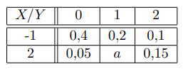
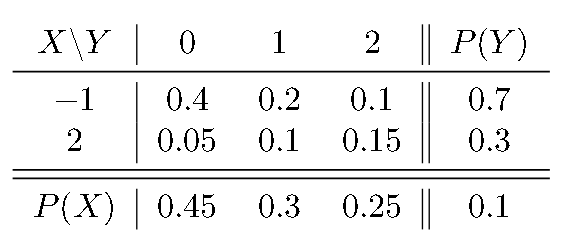
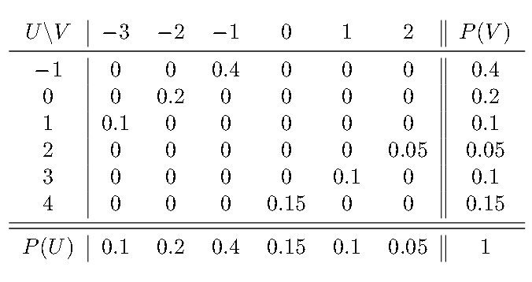

# Ejercicio 04 - Distribución conjunta y variables independientes

**Fecha:** 20-05-2026
**Estado:** 🟢 Resuelto solo

## Consigna

Se consideran dos variables aleatorias: $X$, que toma los valores $-1$ y $1$, e $Y$ que toma los valores $0$, $1$ y $2$ con las probabilidades conjuntas dadas en la siguiente tabla:

1. Hallar $a$.
2. Hallar las funciones de probabilidad marginales de $X$ e $Y$.
3. Hallar la función de probabilidad conjunta de $U=X+Y$ y $V=X-Y$.
4. Hallar las funciones de probabilidad marginales de $U$ y $V$.
5. ¿Son $X$ e $Y$ independientes?
6. ¿Son $U$ e $V$ independientes?

## Resolución

### Parte 1

- Hallar $a$.

Sabemos que toda la tabla tiene que sumar 1, entonces:

$$
\begin{aligned}
&0.4+0.2+0.1+0.05+a+0.15=1\\
&\iff\scriptstyle{(\text{operatoria})}\\
&0.9+a=1\\
&\iff\scriptstyle{(\text{operatoria})}\\
&a=0.1\\
\end{aligned}
$$

### Parte 2

- Hallar las funciones de probabilidad marginales de $X$ e $Y$.

### Parte 3

- Hallar la función de probabilidad conjunta de $U=X+Y$ y $V=X-Y$.

Recordemos que vamos celda por celda para realizar este procedimiento.

#### Variable $U$

1. $X=-1,Y=0$, entonces $X+Y=U=-1$
2. $X=-1,Y=1$, entonces $X+Y=U=0$
3. $X=-1,Y=2$, entonces $X+Y=U=1$
4. $X=2,Y=0$, entonces $X+Y=U=2$
5. $X=2,Y=1$, entonces $X+Y=U=3$
6. $X=2,Y=2$, entonces $X+Y=U=4$

#### Variable $V$

1. $X=-1,Y=0$, entonces $X-Y=V=-1$
2. $X=-1,Y=1$, entonces $X-Y=V=-2$
3. $X=-1,Y=2$, entonces $X-Y=V=-3$
4. $X=2,Y=0$, entonces $X-Y=V=2$
5. $X=2,Y=1$, entonces $X-Y=V=1$
6. $X=2,Y=2$, entonces $X-Y=V=0$

Ahora, para cada par $X,Y$ ubicado en la tabla, calculamos su correspondiente par $(U=X+Y,V=X-Y)$. Estos pares $U,V$ mantendrán la probabilidad que tienen en la tabla inicial:

1. $X=-1,Y=0$, entonces $(U,V)=(-1,-1)$ y por lo tanto $P(U=-1,V=-1)=0.4$
2. $X=-1,Y=1$, entonces $(U,V)=(0,-2)$ y por lo tanto $P(U=0,V=-2)=0.2$
3. $X=-1,Y=2$, entonces $(U,V)=(1,-3)$ y por lo tanto $P(U=1,V=-3)=0.1$
4. $X=2,Y=0$, entonces $(U,V)=(2,2)$ y por lo tanto $P(U=2,V=2)=0.05$
5. $X=2,Y=1$, entonces $(U,V)=(3,1)$ y por lo tanto $P(U=3,V=1)=0.1$
6. $X=2,Y=2$, entonces $(U,V)=(4,0)$ y por lo tanto $P(U=-1,V=1)=0.15$

Con esto estamos en condiciones de realizar la tabla para $U$ y $V$, sabiendo que las únicas celdas con probabilidad distinta de cero son las seis que vimos.

### Parte 4

- Hallar las funciones de probabilidad marginales de $U$ y $V$.

Lo tenemos hallado con la última tabla vista en la parte 3.

### Parte 5

- ¿Son $X$ e $Y$ independientes?

Revisemos nuevamente la tabla conjunta de estas variables:

Con esto sabemos que las variables no son independientes, pues las filas no son proporcionales entre si, véase por ejemplo:

- $\frac{P(X=-1,Y=0)}{P(X=-1,Y=1)}=\frac{0.4}{0.2}=2$
- $\frac{P(X=2,Y=0)}{P(X=2,Y=1)}=\frac{0.05}{0.1}=0.5$

Claramente las proporciones son diferentes, por lo que $X$ e $Y$ no son independientes.

### Parte 6

- ¿Son $U$ e $V$ independientes?

Revisemos nuevamente la tabla conjunta de estas variables:

En este caso, las variables $U$ y $V$ tampoco son independientes, veamos por ejemplo que:

$$
\begin{aligned}
&P_{U,V}(1,-3)\neq P_V(-3)\cdot P_U(1)\\
&\iff\scriptstyle{(\text{reemplazando con los valores de la tabla})}\\
&0.1\neq 0.1\cdot0.1\\
\end{aligned}
$$

Esto demuestra que $U$ y $V$ no son independientes.