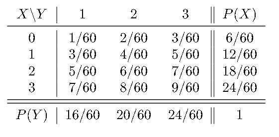

# Ejercicio 06 - Distribución conjunta. Variables independientes

**Fecha:** 08-06-2026
**Estado:** 🟢 Resuelto solo

## Consigna

Se considera la siguiente función $p_{XY}:\mathbb{R}^2\to\mathbb{R}$:

$$p_{XY}(x,y)=\begin{cases}k(2x+y) & \text{si }x\in\{0,1,2,3\},\,y\in R_Y=\{1,2,3\}\\0 & \text{en los otros casos}\end{cases}$$

1. Hallar $k$ para que $p_{XY}$ sea función de probabilidad puntual conjunta.
2. Sean $X$ e $Y$ variables aleatorias discretas con $R_X=\{0,1,2,3\}$ y $R_Y=\{1,2,3\}$, cuya función de probabilidad puntual conjunta es $p_{XY}$. Hallar las funciones de probabilidad puntuales (marginales) $p_X$ y $p_Y$.
3. ¿$X$ e $Y$ son independientes? Justifique la respuesta.
4. Calcular $P\{1\leq X<3,\,2<Y\leq3\}$ y $P\{X+Y<3\}$.

## Resolución

### Parte 1

- Hallar $k$ para que $p_{XY}$ sea función de probabilidad puntual conjunta.

Necesitamos que la suma total de la función de probabilidad puntual sea $1$. Esta será la condición que utilizaremos para obtener $k$. Entonces:

$$
\begin{aligned}
&\sum_{i=0}^3\sum_{j=1}^3k(2i+j)=1\\
&\iff\scriptstyle{(\text{operatoria})}\\
&\sum_{i=0}^3k(2i+1+2i+2+2i+3)=1\\
&\iff\scriptstyle{(\text{operatoria})}\\
&\sum_{i=0}^3k(6i+6)=1\\
&\iff\scriptstyle{(\text{operatoria})}\\
&\sum_{i=0}^3 6k(i+1)=1\\
&\iff\scriptstyle{(\text{operatoria})}\\
&6k+12k+18k+24k=1\\
&\iff\scriptstyle{(\text{operatoria})}\\
&60k=1\\
&\iff\scriptstyle{(\text{operatoria})}\\
&k=\frac{1}{60}\\
\end{aligned}
$$

Esto concluye esta parte.

### Parte 2

- Sean $X$ e $Y$ variables aleatorias discretas con $R_X=\{0,1,2,3\}$ y $R_Y=\{1,2,3\}$, cuya función de probabilidad puntual conjunta es $p_{XY}$. Hallar las funciones de probabilidad puntuales (marginales) $p_X$ y $p_Y$.

Para esta parte lo más fácil será realizar la tabla de distribución correspondiente a la función $p_{XY}$.

### Parte 3

- ¿$X$ e $Y$ son independientes? Justifique la respuesta.

Observando la tabla podemos ver que al no existir proporciones, $X$ e $Y$ no pueden ser independientes, lo verificamos igual considerando $p_{XY}(0,1)$. Para que $X$ e $Y$ sean independientes se tiene que cumplir que:

$$
\begin{aligned}
&p_{XY}(0,1)=^?p_X(0)\cdot p_Y(1)\\
&\iff\scriptstyle{(\text{reemplazando los valores conocidos})}\\
&\frac{1}{60}=^?\frac{1}{10}\cdot\frac{4}{15}\\
&\iff\scriptstyle{(\text{operatoria})}\\
&\frac{1}{60}\neq\frac{4}{150}
\end{aligned}
$$

Como estos valores no son iguales, entonces $X$ e $Y$ no son independientes.

### Parte 4

- Calcular $P\{1\leq X<3,\,2<Y\leq3\}$ y $P\{X+Y<3\}$.

Esto se saca directamente de la tabla que hallamos en las partes anteriores:

- $P\{1\leq X<3,\,2<Y\leq3\}=5/60+7/60=12/60$
- $P\{X+Y<3\}=1/60+2/60+3/60=6/60$

Esto concluye el ejercicio.