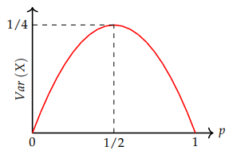

# Clase 10 - Varianza de una variable aleatoria

**Fecha:** 25-06-2026

## La varianza

Nuestro objetivo en esta sección, es definir una medida de la dispersión de una variable aleatoria.

### Definición

- Sea $X$ una variable **discreta** con función de probabilidad puntual $p(x)$. La varianza de $X$ es por definición:

    $$
    Var(X)=\sum_{x\in R_X}(x-E(X))^2p(x)
    $$

- Sea $X$ una variable **continua** con función de probabilidad puntual $p(x)$. La varianza de $X$ es por definición:

$$
Var(X)=\int_{-\infty}^{+\infty}(x-E(X))^2p(x)dx
$$

Es importante recordar que la varianza mide la dispersión de $X$ entorno a su valor esperado. Dicho de forma sencilla, la varianza mide el "ancho" de la gráfica de la f.p.p.

Muchas veces la varianza de una variable $X$ se denota por $\sigma^2$ o $\sigma_X^2$.
La raíz cuadrada de la varianza $\sigma=\sqrt{Var(X)}$ se llama **desvío estándar** de $X$. El desvío $\sigma$ tiene las mismas unidades que $X$, mientras que la varianza tiene las unidades del cuadrado de $X$. Por ejemplo, si $X$ se mide en metros, entonces $\sigma^2$ tiene unidades de metros cuadrados.
Como $\sigma$ y $X$ tienen las mismas unidades, se suele usar el desvío como medida de dispersión.

## Propiedades de la varianza

Usando la fórmula del valor esperado de una función de una variable aleatoria podemos escribir de forma más compacta la definición de varianza. De hecho, notar que si tomamos la función $g(x)=(x-E(X))^2$, tenemos que:

$$
E(g(X))=\sum_{x\in R_X}(x-E(X))^2p(x)\quad(\text{discreto})\\
$$

$$
E(g(X))=\int_{-\infty}^{+\infty}(x-E(X))^2p(x)dx\quad(\text{continuo})\\
$$

Es decir que $Var(X)=E((X-E(X))^2)$.
Veamos ahora algunas propiedades de la varianza que nos permiten simplificar su cálculo.

### La varianza no cambia si sumamos una constante

Sean $X$ una variable aleatoria y $c$ una constante cualquiera. Entonces:

- $Var(X+c)=Var(X)$

#### Demostración

Desarrollando, tenemos que:

$$
\begin{aligned}
&Var(X+c)\\
&=\scriptstyle{(\text{varianza en función de valor esperado})}\\
&E((x+c-E(X+c))^2)\\
&=\scriptstyle{(\text{linealidad de valor esperado, y valor esperado de una constante})}\\
&E((x+\cancel{c}-E(X)-\cancel{c})^2)\\
&=\scriptstyle{(\text{operatoria})}\\
&E((x-E(X))^2)\\
&=\scriptstyle{(\text{varianza en función de valor esperado})}\\
&Var(X)\\
\end{aligned}
$$

Esto concluye la prueba. $\blacksquare$

### La varianza es cuadrática

Sean $X$ una variable aleatoria y $c$ una constante cualquiera. Entonces $Var(cX)=c^2Var(X)$

#### Demostración

Desarrollando, tenemos que:

$$
\begin{aligned}
&Var(cX)\\
&=\scriptstyle{(\text{varianza en función de valor esperado})}\\
&E((cx-E(cX))^2)\\
&=\scriptstyle{(\text{linealidad de valor esperado})}\\
&E((cx-cE(X))^2)\\
&=\scriptstyle{(\text{operatoria})}\\
&E((c(x-E(X)))^2)\\
&=\scriptstyle{(\text{operatoria})}\\
&E(c^2(x-E(X))^2)\\
&=\scriptstyle{(\text{valor esperado de una constante})}\\
&c^2E((x-E(X))^2)\\
&=\scriptstyle{(\text{varianza en función de valor esperado})}\\
&c^2Var(X)\\
\end{aligned}
$$

Esto concluye la prueba. $\blacksquare$

### Una fórmula útil para la varianza

La varianza de una variable $X$ se puede calcular mediante la siguiente igualdad:

- $Var(X)=E(X^2)-E(X)^2$

#### Demostración

Desarrollando, tenemos que:

$$
\begin{aligned}
&Var(X)\\
&=\scriptstyle{(\text{varianza en función de valor esperado})}\\
&E((X-E(X))^2)\\
&=\scriptstyle{(\text{operatoria})}\\
&E(X^2-2XE(X)+E(X)^2)\\
&=\scriptstyle{(\text{linealidad del valor esperado})}\\
&E(X^2)-E(2XE(X))+E(E(X)^2)\\
&=\scriptstyle{(\text{recordando que }E(X)\text{ es una constante})}\\
&E(X^2)-2E(X)E(X)+E(X)^2\\
&=\scriptstyle{(\text{operatoria})}\\
&E(X^2)-2E(X)^2+E(X)^2\\
&=\scriptstyle{(\text{operatoria})}\\
&E(X^2)-E(X)^2\\
\end{aligned}
$$

Esto concluye la prueba. $\blacksquare$

### La varianza de la suma de independientes

Si $X$ e $Y$ son v.a. independientes, entonces:

- $Var(X+Y)=Var(X)+Var(Y)$

#### Demostración

Para probar esta propiedad, recordar primero que:

- $E(XY)=E(X)E(Y)$ cuando $X,Y$ son v.a. independientes

Con esto en mente, desarrollamos:

$$
\begin{aligned}
&Var(X+Y)\\
&=\scriptstyle{(\text{varianza en función de valor esperado})}\\
&E((X+Y-E(X+Y))^2)\\
&=\scriptstyle{(\text{linealidad del valor esperado})}\\
&E((X+Y-E(X)-E(Y))^2)\\
&=\scriptstyle{(\text{reordenando términos})}\\
&E(((X-E(X))+(Y-E(Y)))^2)\\
&=\scriptstyle{(\text{desarrollando el cuadrado})}\\
&E((X-E(X))^2+2(X-E(X))(Y-E(Y))+(Y-E(Y))^2)\\
&=\scriptstyle{(\text{linealidad del valor esperado})}\\
&E((X-E(X))^2)+2E((X-E(X))(Y-E(Y)))+E((Y-E(Y))^2)\\
&=\scriptstyle{(\text{varianza en función de valor esperado})}\\
&Var(X)+2E((X-E(X))(Y-E(Y)))+Var(Y)\quad(*_1)\\
\end{aligned}
$$

A partir de este punto, solo queremos ver que sucede con el segundo término de la suma, si este es cero, tendremos probada la propiedad.

$$
\begin{aligned}
&E((X-E(X))(Y-E(Y)))\\
&=\scriptstyle{(\text{desarrollando el producto})}\\
&E(XY-XE(Y)-YE(X)+E(X)E(Y))\\
&=\scriptstyle{(\text{linealidad del valor esperado, y valor esperado de constante})}\\
&E(XY)-E(X)E(Y)-E(Y)E(X)+E(X)E(Y)\\
&=\scriptstyle{(\text{operatoria})}\\
&E(XY)-E(X)E(Y)\\
&=\scriptstyle{(\text{producto de valores esperados de v.a. independientes})}\\
&E(X)E(Y)-E(X)E(Y)\\
&=\scriptstyle{(\text{operatoria})}\\
&0
\end{aligned}
$$

Por lo tanto, basta reemplazar en $*_1$, obteniendo:

$$
\begin{aligned}
&Var(X+Y)\\
&=\scriptstyle{(*_1)}\\
&Var(X)+2E((X-E(X))(Y-E(Y)))+Var(Y)\\
&=\scriptstyle{(E((X-E(X))(Y-E(Y)))=0)}\\
&Var(X)+Var(Y)\\
\end{aligned}
$$

Esto concluye la prueba. $\blacksquare$

### Ejemplo - Varianza de una Bernoulli

Sea $X$ una variable con distribución de Bernoulli de parámetro $p$. El valor esperado es $E(X)=p$. Entonces, de la definición tenemos que:

$$
\begin{aligned}
&Var(X)\\
&=\scriptstyle{(\text{definición de varianza})}\\
&\sum_{x\in R_X}(x-E(X))^2p(x)\\
&=\scriptstyle{(\text{reemplazando con los valores de }R_X)}\\
&(0-p)^2(1-p)+(1-p)^2\cdot p\\
&=\scriptstyle{(\text{operatoria})}\\
&(1-p)(p^2+(1-p)p)\\
&=\scriptstyle{(\text{operatoria})}\\
&(1-p)(p(p+(1-p)))\\
&=\scriptstyle{(\text{operatoria})}\\
&(1-p)p\\
\end{aligned}
$$

En la siguiente figura, se muestra la varianza de $X$ en función de $p$. Notar que el máximo se da cuando $p=1/2$ y vale $Var(X)=1/4$.

